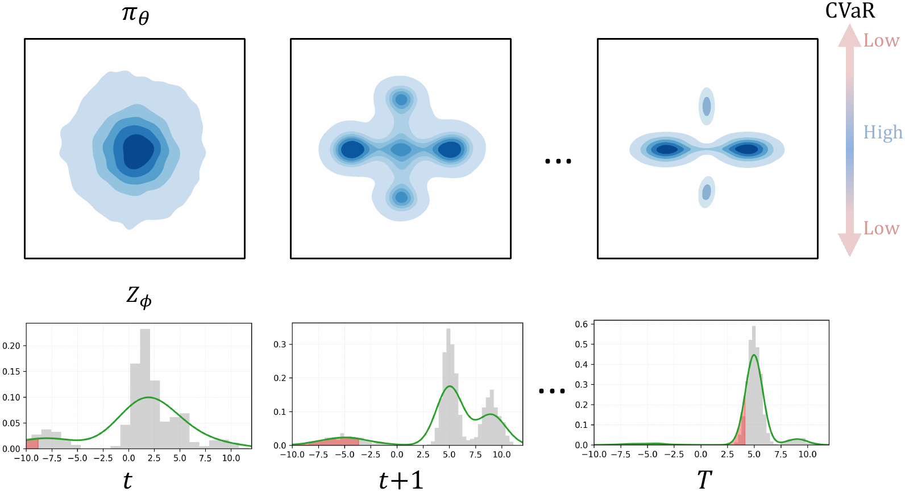

# RAMAC: Multimodal Risk-Aware Offline Reinforcement Learning

[](https://opensource.org/licenses/Apache-2.0)
[](https://www.python.org/downloads/release/python-390/)

This repository provides the official implementation of the paper **RAMAC: Multimodal Risk-Aware Offline Reinforcement Learning and the Role of Behavior Regularization** (**ICML 2026**).

RAMAC is a model-free offline RL framework for direct behavior regularization on expressive generative policies with lower-tail risk control.

<div align="center" style="font-size: 6.0rem;">
<a href="https://arxiv.org/abs/2510.02695"><strong>Paper</strong></a>
&nbsp;&nbsp;|&nbsp;&nbsp;
<a href="https://kaifukazawa.github.io/ramac-project/"><strong>Project Page</strong></a>
&nbsp;&nbsp;|&nbsp;&nbsp;
<a href="https://arxiv.org/pdf/2510.02695"><strong>PDF</strong></a>
</div>

<div style="height: 0.75rem;"></div>

---

<div style="height: 0.5rem;"></div>

<p align="center">
  
</p>

<div style="height: 0.75rem;"></div>

---

<div style="height: 0.5rem;"></div>

> [!NOTE]
> - June 2026: Initial RAMAC code release.
> - April 2026: Accepted to ICML 2026 ✨

## Overview

RAMAC provides a compact implementation for studying risk-aware offline RL with expressive generative policies.

In safety-critical offline RL, catastrophic outcomes can arise from environmental stochasticity as well as out-of-distribution (OOD) actions.

RAMAC uses an actor-critic architecture with an *expressive generative actor* and a *distributional critic*, and optimizes a single objective that combines behavior cloning with lower-tail risk signals to learn multimodal offline policies while reducing OOD actions and catastrophic outcomes under stochastic dynamics.

- **Expressiveness + risk awareness:** learns multimodal offline policies while optimizing lower-tail outcomes under stochastic hazards and OOD-action risk.
- **Generative actor-critic architecture:** extends behavior-regularized actor-critic training with diffusion / flow-matching actors and distributional critics that estimate return quantiles for CVaR, Wang, CPW, and Power distortion objectives.
- **Reproducible Risky-D4RL benchmark tools:** builds stochastic risky variants of multimodal-action D4RL datasets, making hazard settings for risk-aware and safety-oriented offline RL experiments reproducible from public scripts.

## Algorithms Implemented

| Algo | File | Note |
|------|------|------|
| **RADAC** | `agents/radac.py` | Risk-aware diffusion actor-critic |
| **RAFMAC** | `agents/rafmac.py` | Risk-aware flow-matching actor-critic |

All algorithms share a common training entrypoint in `main.py` and YAML-based configuration files in `configs/`.

## Installation

RAMAC requires Python 3.9 and PyTorch. We recommend using `conda` for reproducibility.

```bash
git clone git@github.com:KaiFukazawa/RAMAC.git
cd RAMAC

conda create -n ramac python=3.9.0
conda activate ramac

pip install -r requirements.txt
chmod +x install_mujoco.sh
./install_mujoco.sh

export LD_LIBRARY_PATH=$LD_LIBRARY_PATH:$HOME/.mujoco/mujoco200/bin
```

## Usage

The main training entrypoint is `main.py`.

### Basic Training

```bash
# RADAC on HalfCheetah Medium-Expert
python main.py --env_name halfcheetah-medium-expert-v2 --algo radac --device 0 --seed 0 --exp exp_1

# RAFMAC on HalfCheetah Medium-Replay
python main.py --env_name halfcheetah-medium-replay-v2 --algo rafmac --device 0 --seed 0 --exp exp_2
```

### Working with Risky-D4RL

RAMAC includes risky-D4RL wrappers and dataset creation utilities under `environment/`.

```bash
# Create a risky dataset
python -m environment.risky_create_hdf5 --config environment/configs/halfcheetah-medium-expert-v2.yaml

# Train with risky evaluation enabled
python main.py \
  --env_name halfcheetah-medium-expert-v2 \
  --risky_dataset_path dataset/halfcheetah-medium-expert-v2-risky.hdf5 \
  --eval_risky_env \
  --algo radac \
  --device 0 \
  --seed 0 \
  --save_best_model \
  --exp risky_exp
```

## Configuration

RAMAC uses YAML configuration files for environment-specific hyperparameters.

- `configs/radac.yaml`: RADAC hyperparameters
- `configs/rafmac.yaml`: RAFMAC hyperparameters
- `environment/configs/*.yaml`: risky-D4RL hazard settings

You can override the configuration directory with `--config path/to/config_dir`.

## Repository Structure

- `agents/`: RAMAC policy and critic implementations
- `configs/`: algorithm hyperparameters
- `environment/`: risky-D4RL wrappers and dataset-generation utilities
- `main.py`: shared training and evaluation entrypoint
- `utils/`: RAMAC-owned dataset, critic, risk, and logging utilities

## Acknowledgments

This implementation was developed for RAMAC and was informed by several prior offline RL and benchmark codebases. We gratefully acknowledge [D4RL](https://github.com/rail-berkeley/d4rl), [MuJoCo](https://github.com/deepmind/mujoco), [Diffusion-QL](https://github.com/Zhendong-Wang/Diffusion-Policies-for-Offline-RL), [Flow QL](https://github.com/seohongpark/fql), and [ORAAC](https://github.com/nuria95/O-RAAC).

## Citation

If you use this code in your research, please cite:

```bibtex
@article{fukazawa2025ramac,
  title={RAMAC: Multimodal Risk-Aware Offline Reinforcement Learning and the Role of Behavior Regularization},
  author={Fukazawa, Kai and Mundada, Kunal and Soltani, Iman},
  journal={arXiv preprint arXiv:2510.02695},
  year={2025}
}
```
